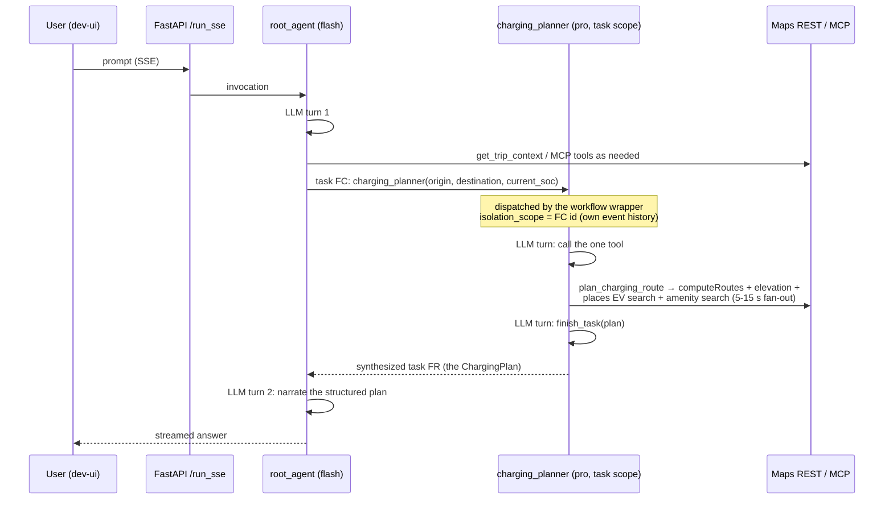

# Architecture

Status: current as of Phase 1 + Charging Planner v2 (2026-07). Matches the
implemented code — update alongside `specs/` when behavior changes.

## 1. Components (as implemented)

| Component | Kind | Model | Responsibility | Code |
|---|---|---|---|---|
| `root_agent` | LlmAgent, chat mode | gemini-3.5-flash | Conversation state, grounding, routing, narration | `agent.py` |
| `charging_planner` | LlmAgent, **task mode** (`mode="task"`, `output_schema=ChargingPlan`) | gemini-3.1-pro-preview | Tesla charging plans; single tool wraps the whole deterministic algorithm | `agent.py`, `tools.plan_charging_route` |
| `park_logistics` | LlmAgent wrapped as **AgentTool** | gemini-3.5-flash | Park weather + NPS alerts + hike suggestions | `agent.py` |
| `get_trip_context` | plain Python tool | — | Fixed trip facts from `specs/01-trip-context.md` (dates, lodging, group splits) | `tools.py` |
| `save_and_upload_trip_plan` | plain Python tool | — | Markdown itinerary → GCS signed URL | `tools.py` |
| Maps **MCP** toolset | `McpToolset` (streamable HTTP, `mapstools.googleapis.com/mcp`) | — | `compute_routes` / `search_places` / `lookup_weather` for LLM agents, scoped per agent via `tool_filter` | `tools.get_maps_mcp_toolset` |
| Maps **REST** client | direct HTTP (no LLM, no MCP) | — | Routes v2, Elevation, Places EV/amenity search used by the deterministic planner | `maps_client.py` |
| NPS API | direct HTTP with mock fallback | — | Park alerts (`source: live|mock`) | `tools.get_nps_alerts` |

Two distinct Maps paths on purpose: LLM agents use the **MCP toolset** (the
model decides calls); the charging algorithm uses the **REST client** in
plain Python so identical inputs always give identical plans.

## 2. Anatomy of one charging prompt

"We're at 70% leaving Driggs for West Yellowstone — do we need to charge?"

Key mechanics:
- **Task delegation** is a function call whose name is the sub-agent's name.
  The workflow wrapper dispatches the sub-agent with `isolation_scope = FC id`
  so its internal events (its own LLM turns, `plan_charging_route`,
  `finish_task`) are invisible to the root's context, and synthesizes a
  function *response* carrying the structured output back to the root.
- Every FC must have a paired FR in the same scope, or context rebuilding
  fails ("No function call event found..."). `adk_patches.py` works around a
  google-adk 2.3/2.4 bug where, under SSE token streaming, the wrapper
  dispatched from a *partial* (never-persisted) event and broke that pairing.
- `park_logistics` is the other pattern (**AgentTool**): a normal tool call
  that runs a whole sub-agent inline and returns its text.

## 3. Watching it work in real time

| Surface | What you see | How |
|---|---|---|
| **Terminal flow log** | One line per hop, live: `>> [root_agent] run started`, `-> tool get_trip_context({...})`, `>> [charging_planner] run started`, `maps REST computeRoutes ...` | On by default (`flow_log.py`); disable with `FLOW_LOG=0` |
| **dev-ui Events tab** | Every persisted event: each FC with full args (this is where a wrong `current_soc` is visible), each FR with the full result | `/dev-ui` → pick session → Events |
| **dev-ui Trace tab** | Span waterfall per prompt: `invocation → agent_run → call_llm / execute_tool`, with latencies | `/dev-ui` → Trace |
| **Wire-level logs** | Full request/response internals | `logging.getLogger("google_adk").setLevel(logging.DEBUG)` in `main.py` (verbose) |
| **Evals** | Regression-grade behavior checks (grounding, delegation, disclosure) | `pytest -m eval` |

Debugging recipe for a suspicious answer: find the prompt in **Events**, read
the task FC args (did the root pass sane inputs?), then the FR (did the
deterministic plan already contain the problem, or did narration distort
it?), then Trace for where time went. The terminal flow log gives you the
same story live without clicking.

## 4. Guardrails encoded in the planner

- Consumption is elevation-adaptive per ~5-mile chunk (280 Wh/mi base,
  +7 Wh/m climb, −2.8 Wh/m descent credit = conservative 40% regen).
- Charge targets: 80% default, stretched up to a **hard 95% cap**; a stop
  where the car arrives above target becomes "No charging needed" —
  targets never exceed 95 even when departing at 100%.
- `current_soc` inputs are validated to 10–100; the root agent must ask for
  the battery level rather than assume one.
- Chargers: ≥100 kW CCS/Tesla (50 kW fallback with a warning note), live
  availability filtering, amenity-preferred ranking, 10% arrival buffer.

## 5. SDD tie-in

Specs are the source of truth; this doc is the map between them and code:
`specs/01-trip-context.md` (fixed facts) · `specs/02-charging-agent.md`
(planner v2 algorithm) · `specs/05-testing.md` (test strategy). Architecture
changes must update this file and the relevant spec together.
